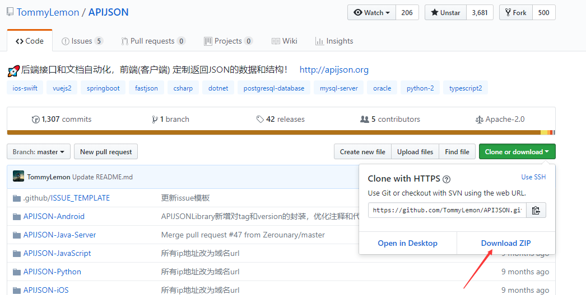
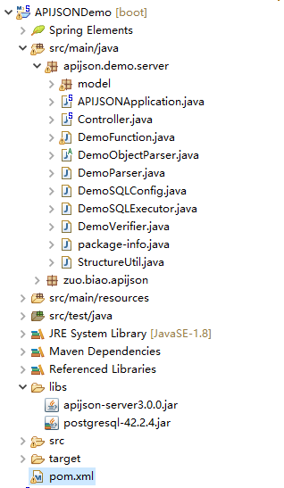

# 安装

## 环境配置

JDK: 1.8+

MAVEN: 3.0+

数据库: Mysql / Oracle

## 下载项目

```git
git clone https://github.com/TommyLemon/APIJSON.git
```

或者，直接下载 ZIP 打包好的项目文件。



## 导入项目

Eclipse 导入：

顶部菜单 File > Import > Maven > Existing Maven Projects > Next > Browse

你的 clone 的项目所在目录/APIJSON-Master/APIJSON-Java-Server/APIJSONBoot

报依赖错误的时候，同目录下的 lib 里面的 jar 添加到 Build Path 中。


为了方便修改源代码，你可以像我一样不添加 libs/apijson-orm-3.5.1.jar 文件到 Build Path 中。而是 libs/apijson-orm-3.5.1.jar 的源码，复制到当前项目里。

源代码在 APIJSON-Master/APIJSON-Java-Server/APIJSONORM 项目中。

## 错误修改

如果使用最新版本的 Mysql 8，由于驱动更新。有可能这时候 pom.xml 会报错，例如：

```java
<project xmlns="http://maven.apache.org/POM/4.0.0" xmlns:xsi="http://www.w3.org/2001/XMLSchema-instance"
	xsi:schemaLocation="http://maven.apache.org/POM/4.0.0 http://maven.apache.org/xsd/maven-4.0.0.xsd">
```

这段代码中的这一句：

```java
xsi:schemaLocation="http://maven.apache.org/POM/4.0.0 http://maven.apache.org/xsd/maven-4.0.0.xsd">
```

提示错误。 其实是 maven 中安装包的问题。 那么在你的 maven 包存放路径，例如（Window->Preference->Maven->User Settings）中删除对应的包，然后使用 Maven 重新下载。
具体操作请自行百度。
国内请使用 Maven 的镜像安装，更快！
